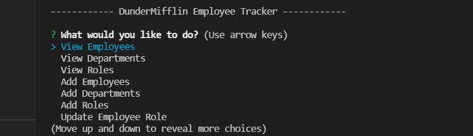
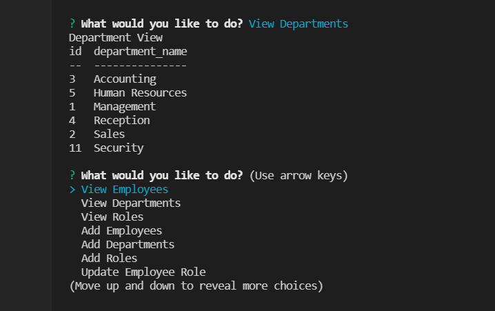

# Employee Tracker

# Description:

This project is a A SQL database that tracks employees, their roles, and their respective department.

# Usage:

* The user is presented with the title of the application.
* The user is then presented with a list of options for what they would like to do first.
* Once the user selects the desired action, they are presented with a response based on their selection.
* The Selection Menus:
    - "View Employees" will present with user with a table of employees in database
    - "View roles" will present the user with a table of all roles currently in the database.
    - "Add Employee will allow user to add an employee to database.
    - "Add role" will present the user with prompts to add a role to database.
    - "Add department" will allow user to prompt to add department to database
    - "Update employee" will allow user to update employee's information

# Technologies

- HTML
- CSS
- Javascript:
- Node.js
- Express.js
- Npm
- sql

# Initialize

To use the database, use the command
node employeeManager.js

# Screenshots:

# Deployed Link:

(https://drive.google.com/file/d/1OTbnvHDfE1YbWitth9Pq9YxAEAdAiQ9k/view)

